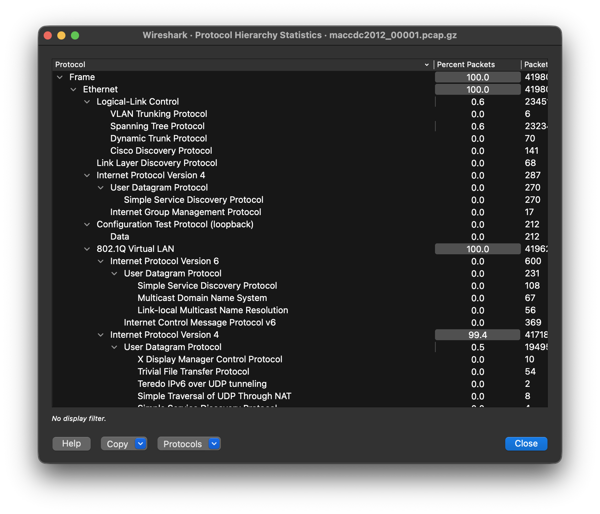
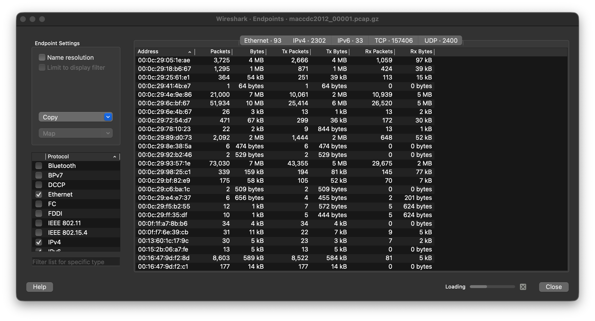

Wireshark ([wireshark.org](https://www.wireshark.org)) is a free and open-source protocol analyzer.

# Statistics Feature
The Wireshark **Statistics** tab has several windows that allow you to quickly explore a .pcap at a high level. These include:
- Protocol Hierarchy
- Endpoints
- Conversations
## Protocol Hierarchy
Gives you a high-level overview of the dissected protocols, in tree format by layer.

## Endpoints
Gives you identified endpoints (Ethernet, IPv4, TCP/UDP, etc) based on various protocols Wireshark can dissect.

## Conversations
A step up from **Endpoints**, shows who has been talking to who based on various protocols Wireshark can dissect.